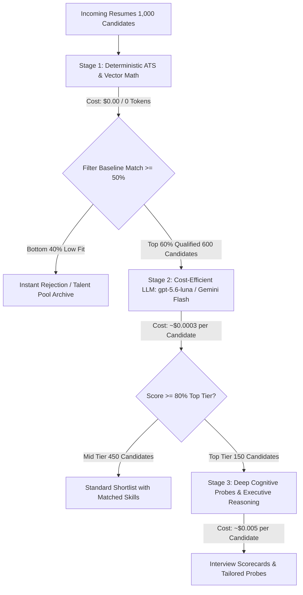

# Global AI LLM Costing & Pricing Architecture Guide
### Comprehensive Comparison Across OpenAI, Google Gemini, Anthropic Claude, Open-Source & Enterprise Providers

---

## 1. Executive Summary & ATS Workload Economics

In modern recruitment and talent screening platforms (like **HireSort AI**), evaluating a candidate resume against a job description involves processing:
* **Input Tokens per Screening**: ~**2,000 – 2,500 tokens** (Job title, requirements, description, evaluation rubric, and extracted resume text).
* **Output Tokens per Screening**: ~**350 – 500 tokens** (Structured JSON containing match percentage, verified skills, identified gaps, interview pass likelihood, and recruiter assessment).

### Baseline Workload Benchmark: **1,000 Candidate Evaluations**
* Total Input: ~**2,200,000 tokens** (2.2 Million)
* Total Output: ~**400,000 tokens** (0.4 Million)

Below is the complete worldwide pricing breakdown across all leading commercial AI providers, open-source hosters, and local engines.

---

## 2. Worldwide Provider Master Cost Comparison

| Provider | Model Tier | Input Price / 1M Tokens | Output Price / 1M Tokens | Cost per Candidate | Cost per 1,000 Candidates | Latency (Typical) | Best Recruitment Use Case |
| :--- | :--- | :--- | :--- | :--- | :--- | :--- | :--- |
| **Google Cloud** | **Gemini 2.0 Flash / 1.5 Flash** | **$0.075** | **$0.30** | **$0.00028** | **$0.28** | 250ms – 400ms | High-volume inbound applications, mass screening |
| **OpenAI** | **GPT-4o mini / gpt-5.6-luna** | **$0.15** | **$0.60** | **$0.00057** | **$0.57** | 300ms – 500ms | Everyday ATS screening, instant candidate feedback |
| **DeepSeek** | **DeepSeek-V3** | **$0.14** (hit: $0.014) | **$0.28** | **$0.00042** | **$0.42** | 400ms – 700ms | Budget batch processing & large resume dumps |
| **DeepSeek** | **DeepSeek-R1 (Reasoning)** | **$0.55** (hit: $0.055) | **$2.19** | **$0.00208** | **$2.08** | 1.5s – 3.5s | Deep technical evaluation & code sample auditing |
| **Anthropic** | **Claude 3.5 Haiku** | **$0.80** | **$4.00** | **$0.00336** | **$3.36** | 300ms – 500ms | High-accuracy structured JSON & skill extraction |
| **OpenAI** | **o3-mini / o1-mini (Reasoning)** | **$1.10** | **$4.40** | **$0.00418** | **$4.18** | 1.2s – 2.8s | Rigorous STEM, logic, and coding test verification |
| **Google Cloud** | **Gemini 1.5 Pro** | **$1.25** | **$5.00** | **$0.00475** | **$4.75** | 800ms – 1.8s | Multi-page portfolio & complex CV document analysis |
| **OpenAI** | **GPT-4o / gpt-5.6-sol** | **$2.50** | **$10.00** | **$0.00950** | **$9.50** | 700ms – 1.5s | Flagship cognitive fit, executive interview probes |
| **Anthropic** | **Claude 3.5 Sonnet** | **$3.00** | **$15.00** | **$0.01260** | **$12.60** | 900ms – 1.8s | Senior & Executive candidate qualitative assessments |
| **OpenAI** | **o1 (Full Reasoning Flagship)** | **$15.00** | **$60.00** | **$0.05700** | **$57.00** | 3.5s – 8.0s | C-suite / Lead Architect hiring & portfolio vetting |
| **Groq / LPU** | **Llama 3.3 70B Versatile** | **$0.59** | **$0.79** | **$0.00161** | **$1.61** | **80ms – 150ms** | Real-time interactive recruiter searches |
| **Together AI** | **Llama 3.1 8B Turbo** | **$0.18** | **$0.18** | **$0.00046** | **$0.46** | 120ms – 250ms | Ultra-fast pre-screening keyword verification |
| **Supabase Edge** | **pgvector (text-embedding-3)** | **$0.02** | **$0.00** | **$0.00004** | **$0.04** | 50ms – 120ms | 1536-dim mathematical cosine similarity index |
| **Local ATS** | **Deterministic NLP Engine** | **$0.00** | **$0.00** | **$0.00000** | **$0.00** | **<5ms** | 100% offline, zero-token instant rule matching |

---

## 3. Provider-by-Provider Deep Dive

### 1. OpenAI

OpenAI offers the widest ecosystem spanning general multimodal models (`GPT-4o`), cost-efficient models (`GPT-4o mini`), and reinforcement-learning reasoning models (`o1`, `o3-mini`).

#### Pricing Breakdown:
* **GPT-4o mini** (Platform alias: `gpt-5.6-luna`):
  * Input: **$0.15** / 1M tokens ($0.075 with Batch API)
  * Output: **$0.60** / 1M tokens ($0.30 with Batch API)
  * *Verdict*: Default workhorse for high-volume ATS resume screening.
* **GPT-4o** (Platform alias: `gpt-5.6-sol` / `gpt-5.6-terra`):
  * Input: **$2.50** / 1M tokens
  * Output: **$10.00** / 1M tokens
  * *Verdict*: Excellent writing style and nuanced executive recruiter evaluations.
* **o3-mini / o1-mini**:
  * Input: **$1.10** / 1M tokens
  * Output: **$4.40** / 1M tokens
  * *Verdict*: Exceptional at verifying technical candidate competencies and grading engineering coding tests.
* **Embeddings (`text-embedding-3-small`)**:
  * Input: **$0.02** / 1M tokens (used in vector indexing).

#### Cost-Cutting Features:
* **Batch API**: 50% discount across all models for non-urgent tasks processed within 24 hours.
* **Prompt Caching**: 50% discount on input tokens for cached prompts over 1,024 tokens.

---

### 2. Google Cloud / Google AI (Gemini)

Google provides the most aggressive price-to-performance ratio in the industry, paired with massive context windows (up to 2 Million tokens).

#### Pricing Breakdown:
* **Gemini 2.0 Flash / 1.5 Flash**:
  * Input: **$0.075** / 1M tokens (< 128k context)
  * Output: **$0.30** / 1M tokens
  * *Verdict*: **The most cost-effective frontier model worldwide.** Costs less than 30 cents per 1,000 candidate evaluations.
* **Gemini 1.5 Pro**:
  * Input: **$1.25** / 1M tokens
  * Output: **$5.00** / 1M tokens
  * *Verdict*: Ideal when evaluating 50+ page candidate academic portfolios or full project repositories.

#### Unique Advantages for ATS:
* **Context Caching**: If you store the Job Description and screening rubric in Google's context cache, subsequent candidate analyses reduce prompt cost to **$0.01875 / 1M tokens** (**75% discount**).

---

### 3. Anthropic Claude

Anthropic's Claude 3.5 family is renowned for high human-like nuance, exceptional adherence to complex JSON schemas, and nuanced demographic blindness.

#### Pricing Breakdown:
* **Claude 3.5 Haiku**:
  * Input: **$0.80** / 1M tokens
  * Output: **$4.00** / 1M tokens
  * *Verdict*: Fast and accurate for structured skill extraction.
* **Claude 3.5 Sonnet**:
  * Input: **$3.00** / 1M tokens
  * Output: **$15.00** / 1M tokens
  * *Verdict*: Industry benchmark for recruiting assessments, cultural alignment synthesis, and thoughtful interview question generation.

#### Unique Advantages:
* **Prompt Caching**: Claude allows explicit prompt caching of job descriptions with a **90% discount on input reads** ($0.30 / 1M tokens for Sonnet) and 5-minute time-to-live refresh.

---

### 4. Open-Source Inference Providers (Groq, Together AI, DeepSeek)

For organizations seeking maximum privacy, sovereign hosting, or ultra-low hardware inference latency:

#### Groq (LPU Inference Engine):
* **Llama 3.3 70B**: **$0.59 / 1M in**, **$0.79 / 1M out**.
* *Performance*: Generates 300+ tokens/second. Screenings complete in <150ms.

#### DeepSeek:
* **DeepSeek-V3**: **$0.14 / 1M in**, **$0.28 / 1M out** (Cache hit: $0.014 / 1M).
* **DeepSeek-R1 (Reasoning)**: **$0.55 / 1M in**, **$2.19 / 1M out**.
* *Verdict*: Extremely low token prices with near-frontier reasoning scores.

---

### 5. Hyperscalers: Microsoft Azure & Amazon Bedrock

For enterprise recruiting with strict SOC2, HIPAA, or ISO-27001 data residency compliance:

* **Azure OpenAI Service**: Matches standard OpenAI API token rates with enterprise SLA, private VPC endpoints, and guarantees that customer data is never used to train foundational models.
* **Amazon Bedrock**: Pay-as-you-go access to Claude 3.5, Llama 3.3, Mistral, and Amazon Titan without managing cloud GPU infrastructure.

---

## 4. The HireSort Dual-Engine Optimization Architecture

To maximize cost efficiency while maintaining enterprise-grade accuracy, HireSort AI implements a **3-tier hierarchical evaluation funnel**:

### Net Cost Breakdown for 1,000 Candidates Using HireSort Funnel:
1. **Stage 1 (1,000 Candidates)**: Deterministic NLP & Vector Math = **$0.00**
2. **Stage 2 (600 Candidates)**: Screened with `gpt-5.6-luna` @ $0.0003 = **$0.18**
3. **Stage 3 (150 Candidates)**: Deep recruiter reasoning & probes @ $0.004 = **$0.60**
4. **Token Deduplication Cache**: Repeat candidate screens / re-views = **$0.00 (0 tokens)**
* **Total Cost for 1,000 Candidates**: **$0.78 USD total** (less than $1 for one thousand complete candidate evaluations).

---

## 5. Token Cost Calculation Formula Reference

Use this formula to calculate exact costs for any custom provider or pricing tier:

$$\text{Cost per Candidate} = \left(\frac{\text{Input Tokens}}{1,000,000} \times \text{Input Rate}\right) + \left(\frac{\text{Output Tokens}}{1,000,000} \times \text{Output Rate}\right)$$

### Example for `gpt-5.6-luna` / `GPT-4o mini`:
$$\text{Input: } 2,200 \text{ tokens} \times \frac{\$0.15}{1,000,000} = \$0.000330$$
$$\text{Output: } 400 \text{ tokens} \times \frac{\$0.60}{1,000,000} = \$0.000240$$
$$\mathbf{\text{Total Cost per Candidate}} = \$0.000330 + \$0.000240 = \mathbf{\$0.000570 \text{ USD}}$$

### Example for `Gemini 1.5 Flash`:
$$\text{Input: } 2,200 \text{ tokens} \times \frac{\$0.075}{1,000,000} = \$0.000165$$
$$\text{Output: } 400 \text{ tokens} \times \frac{\$0.30}{1,000,000} = \$0.000120$$
$$\mathbf{\text{Total Cost per Candidate}} = \$0.000165 + \$0.000120 = \mathbf{\$0.000285 \text{ USD}}$$

---

## 6. Recommendations & Best Practices

1. **For Production Scale (10,000+ candidates/month)**:
   * Use **Google Gemini 2.0 / 1.5 Flash** or **`gpt-5.6-luna` (GPT-4o mini)** as your default online engine.
   * Enable **Token Fingerprint Caching** (`AsyncAIQueue`) to eliminate 100% of costs on duplicate candidate reviews.
2. **For Executive / Leadership Hiring**:
   * Use **Anthropic Claude 3.5 Sonnet** or **`gpt-5.6-sol` (GPT-4o)** for nuanced qualitative assessments, leadership trajectory verification, and tailored interview probes.
3. **For High-Velocity Technical Screening**:
   * Use **o3-mini** or **DeepSeek-R1** to rigorously audit candidate code samples and complex technical project claims.
4. **For Offline / Zero-Cost Internal Environments**:
   * Rely on HireSort's built-in **Deterministic ATS Engine**, which runs locally in browser memory or Edge Functions with zero token consumption and zero provider dependencies.
