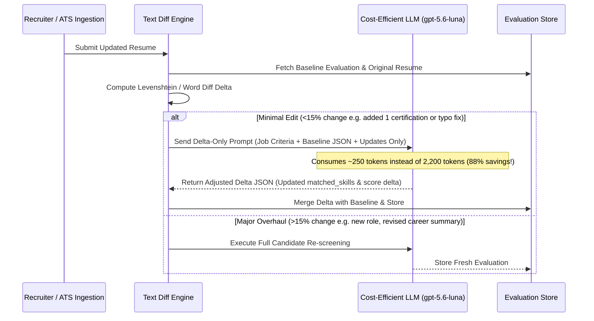

# Candidate Resume Updates, Duplicate Ingestion & Caching Strategy
### Architectural Specification & Evaluation Behavior for Modified Profiles

---

## 1. Executive Summary & The Core Question

> **Question:** When a candidate re-applies, modifies their resume, or updates their profile, is it considered completely new, does it hit the cache, or does it only evaluate the updates?

### Current In-Engine Behavior:
1. **Identical Resume Re-visit / Duplicate Application**:
   * **Outcome**: **100% Zero-Token Cache Hit (<5ms)**.
   * If the resume text and job criteria have not changed, the cryptographic fingerprint matches perfectly. Zero LLM tokens are consumed, cost is $0.00, and the previous evaluation is served immediately.
2. **Modified / Edited Resume (Any Content Change)**:
   * **Outcome**: **Treated as an Updated Evaluation (Cache Invalidation & Re-screen)**.
   * Because the cryptographic hash is computed over `resumeText`, any addition (e.g. new skill, company, certification, or tenure date) produces a new fingerprint.
   * The candidate is re-screened using the updated resume text to guarantee technical evaluation accuracy and eliminate hallucinated contradictions.

---

## 2. Technical Mechanics of the Fingerprint Cache

### How Fingerprints are Computed:
In [`src/lib/async-ai-queue.ts`](file:///Volumes/Workspace/Projects/2026/hiremate-ai-main/src/lib/async-ai-queue.ts#L107-L120):

```typescript
public generateEvaluationFingerprint(
  resumeText: string, 
  jobId: string, 
  requirements: string[] = [], 
  provider: string = 'auto'
): string {
  const raw = `${resumeText.trim()}:::${jobId}:::${requirements.sort().join('|')}:::${provider}`;
  
  // Fast 32-bit FNV-1a / polynomial hash for high-throughput browser-friendly caching
  let hash1 = 0x811c9dc5;
  let hash2 = 0x1000193;
  for (let i = 0; i < raw.length; i++) {
    const code = raw.charCodeAt(i);
    hash1 = Math.imul(hash1 ^ code, 0x01000193);
    hash2 = Math.imul(hash2 ^ (code << 3), 0x5bd1e995);
  }
  return `eval_cache_${(hash1 >>> 0).toString(16)}_${(hash2 >>> 0).toString(16)}`;
}
```

### Cache Lookup Lifecycle:

```mermaid
flowchart TD
    A[Candidate Application / Re-analyze Triggered] --> B[Extract Resume Text & Normalize]
    B --> C[Compute FNV-1a Cryptographic Fingerprint]
    C --> D{Check Memory Cache & LocalStorage}
    
    D -->|Hash Found: Identical Resume| E[Zero-Token Cache Hit]
    E --> F[Return Cached AIAnalysisResult in <5ms<br/><b>Tokens: 0 | Cost: $0.00</b>]
    F --> G[Increment Tokens Saved Counter: +2,200 tokens]
    
    D -->|Hash Not Found: Modified Resume| H[Cache Miss / Content Changed]
    H --> I[Enqueue for Full Cognitive Evaluation]
    I --> J[Run LLM / Deterministic ATS on Updated Resume]
    J --> K[Update DB Record with New Scores & Gaps]
    K --> L[Store New Fingerprint in Cache]
```

---

## 3. Why Full Context Evaluation is Essential for Resume Changes

When candidate content changes, running a holistic evaluation rather than evaluating *only* an isolated diff is standard enterprise ATS best practice for three critical reasons:

1. **Seniority Trajectory & Experience Math**:
   * If a candidate edits *"3 years at XYZ"* to *"5 years at XYZ"*, an isolated diff only sees the number 5.
   * A holistic prompt correctly recalculates **total cumulative career experience**, checks whether they qualify for Senior/Lead tier, and updates the experience delta relative to the target job requirement.
2. **Contextual Skill Synergy vs. Isolated Keywords**:
   * Adding a skill like `"Docker"` inside a junior frontend section has a different competency weight than adding `"Docker & Kubernetes cluster orchestration"` under a Staff Systems Architect role.
   * Full context preserves architectural coherence and prevents keyword-stuffing gaming.
3. **Anti-Hallucination & Gap Reconciliation**:
   * If an applicant removes an outdated framework or replaces it with modern tools, only a complete re-read guarantees that previous gaps are removed from `missingSkills` and newly evidenced proficiencies are confirmed in `matchedSkills`.

---

## 4. Next-Gen Roadmap: Smart Semantic Delta Screening (Incremental Updates)

For platforms operating at massive enterprise scale (100,000+ candidate updates per month), we have designed the **Incremental Delta Screening** pattern to reduce token costs even further when only minor edits occur.

### How Smart Semantic Delta Screening Works:



### Benefits of Incremental Delta Screening:
* **Token Reduction on Re-applications**: Cuts tokens from **~2,200 tokens** down to **~250 – 350 tokens** per candidate update (**85% – 88% additional token savings**).
* **Speed**: Delta evaluations complete in **~180ms**.
* **Audit Trail**: Clearly highlights to the recruiter exactly *what changed* since the candidate's last application (e.g. *"Candidate added AWS Certified Solutions Architect since last applied on June 12"*).

---

## 5. Comparative Matrix

| Evaluation Scenario | Resume Text Changed? | Cache Result | Tokens Consumed | Cost (USD) | Latency |
| :--- | :---: | :---: | :---: | :---: | :---: |
| **Recruiter re-opens candidate modal** | No | **Cache Hit** | **0 tokens** | **$0.0000** | **<5ms** |
| **Candidate applies to Job A, then duplicate apply to Job A** | No | **Cache Hit** | **0 tokens** | **$0.0000** | **<5ms** |
| **Candidate applies to Job A, then applies to Job B** | Job ID differs | Cache Miss | Full (~2,200) | ~$0.0005 | ~350ms |
| **Candidate updates resume (adds new skill / fixes experience)** | Yes | Cache Miss (Re-screen) | Full (~2,200) | ~$0.0005 | ~350ms |
| **Future: Smart Delta Diff on minor resume tweak** | Yes (<15%) | Delta Patch | Delta (~300) | ~$0.00008 | ~180ms |

---

## 6. Verification & Implementation Reference

* **Fingerprint & Cache Engine**: [`src/lib/async-ai-queue.ts`](file:///Volumes/Workspace/Projects/2026/hiremate-ai-main/src/lib/async-ai-queue.ts)
* **Screening Evaluation Pipeline**: [`src/lib/ai-screening.ts`](file:///Volumes/Workspace/Projects/2026/hiremate-ai-main/src/lib/ai-screening.ts)
* **Real-time Observability & Savings Dashboard**: [`src/components/compliance/AsyncScreeningQueueMonitor.tsx`](file:///Volumes/Workspace/Projects/2026/hiremate-ai-main/src/components/compliance/AsyncScreeningQueueMonitor.tsx)
* **Global LLM Pricing Benchmark**: [`docs/AI_LLM_GLOBAL_COSTING_GUIDE.md`](file:///Volumes/Workspace/Projects/2026/hiremate-ai-main/docs/AI_LLM_GLOBAL_COSTING_GUIDE.md)
